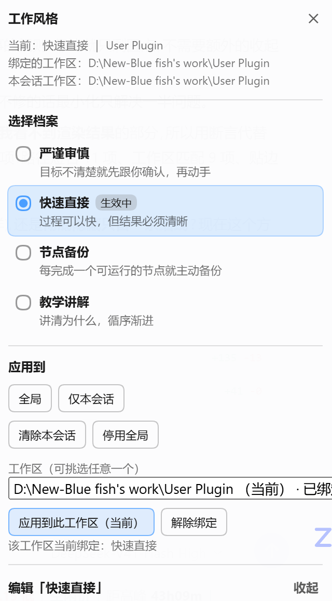

# dsh-user-style

> 让 AI 记住「你喜欢怎么被对待」。一次设定，之后**每个新对话**都带着你的工作风格。



（上图：工作页面右下角的小药丸点开后。来源：本插件实际运行截图。）

---

## 它解决什么问题

DSH 每开一个新对话，AI 都不记得你这个人喜欢怎么被对待：

- 有人要**严谨**：目标不清楚就先问，别自己猜着往下做
- 有人要**快**：有更成熟的做法直接用，别反复自检，能用就赶紧交给我测
- 有人要**节点备份**：每跑通一个功能就自己存一版，不用我盯着
- 有人要**教学**：先讲为什么，再给代码

这些偏好本来只存在于你的脑子里。本插件把它们变成一份可编辑的档案，并在**每次提示词组装时**注入系统提示词——所以换新对话也不会忘，改一下当场生效。

## 特性

- **悬浮面板**：工作页面右下角一枚可拖动的小药丸，点开就能切档案、切作用范围，不用钻进设置页
- **三层作用域**：全局默认 → 按工作区绑定（从你用过的工作区列表里挑）→ 仅本会话临时覆盖
- **开箱 4 套预设**：严谨审慎 / 快速直接 / 节点备份 / 教学讲解，都可以改
- **AI 可以提议改风格**：你说「以后都先给结论」，它会先复述确认，你点头才写入
- **默认不注入**：装上不等于生效，不主动启用就不会改变你现有对话的行为
- **零外部依赖**：宿主侧只用 Node 内置模块，装在哪都能加载

## 安装

> ⚠️ 装完必须**完全退出并重开** DeepSeek Harness。宿主侧改动不热更新——这是 DSH 桌面端的行为（HMR 的文件监听根是空的），不是插件的问题。

### 方式一：在 DSH 里直接装（最省事）

侧边栏 → **插件** → 安装，填本仓库地址：

```
github:himoew/dsh-user-style
```

如果界面的输入框只接受包名，用方式二。

### 方式二：克隆 + 一键脚本

```bat
git clone https://github.com/himoew/dsh-user-style.git
cd dsh-user-style
install.bat
```

脚本会做三件事，并逐步打印结果：

1. 优先调用官方 `dsh plugin` CLI 安装（顺带同步 pnpm 锁文件）
2. 找不到 CLI 时退回手动方式：在 profile 的 `node_modules` 里建一个指向本仓库的 **junction**（目录联接，不需要管理员权限）
3. 把 `dsh-user-style` 写进 profile 的 `package.json`（依赖 + `dsh.profile.bundles`），**写前自动备份** 成 `package.json.bak-dsh-user-style`

其它用法：

```bat
install.bat -Manual        :: 跳过 CLI，直接用手动方式
install.bat -DshCli "D:\...\resources\runtime\cli\bin\dsh.cmd"
```

### 方式三：手动

在 `<DSH_HOME>\profiles\desktop\` 下（`DSH_HOME` 默认 `%USERPROFILE%\.dsh`）：

```powershell
# 1) 建链接
New-Item -ItemType Junction -Path ".\node_modules\dsh-user-style" -Target "<本仓库绝对路径>"

# 2) 手工编辑 package.json：dependencies 里加 "dsh-user-style": "link:<本仓库路径>"
#    并把 "dsh-user-style" 追加进 dsh.profile.bundles 数组
```

## 使用

### 悬浮面板

右下角的小药丸显示当前状态：`● 风格 · 快速直接 · User Plugin`

- **蓝点** = 已启用，灰点 = 未启用
- 后面的文字是**当前生效的档案名**和**作用范围**（工作区会显示文件夹名，全局显示「全局」，临时覆盖显示「仅本会话」）
- **可拖动**，位置会记住；拖到屏幕边缘会缩成一个小圆点，拖回来恢复
- 点开：选档案 → 点「全局 / 仅本会话 / 应用到此工作区」→ 当场生效（下一条消息就带上）

### 三层作用域

生效顺序，上层覆盖下层：

| 层 | 作用范围 | 怎么设 |
|---|---|---|
| 会话覆盖 | 仅当前对话 | 面板「仅本会话」 |
| 工作区绑定 | 某个项目目录及其子目录 | 面板的工作区下拉列表里挑一个 → 「应用到此工作区」 |
| 全局默认 | 所有对话 | 面板「全局」 |

工作区匹配用「最长前缀 + 路径边界」：把 `D:\proj` 绑到 A 档后，`D:\proj\inner` 还能再绑 B 档（更具体者胜），而 `D:\proj-other` **不会**被误命中。

工作区列表来自 DSH 自己的工作区台账 `<DSH_HOME>\storages\workspace.json`，也就是你**实际用过**的那些工作区。

### 内置预设

条目会被**逐条原样注入**，所以措辞就是行为约定。

| 名称 | 一句话 | 要点 |
|---|---|---|
| 严谨审慎 | 目标不清楚就先跟你确认，再动手 | 不确定/模糊/多方案 → 先确认目标；歧义不自行假设；确认前不改代码不动文件；有更好的想法先讨论 |
| 快速直接 | 过程可以快，但结果必须清晰 | 有更成熟的方法直接用不必问；不长篇自检；可用就尽快交给你实测；结束时总结选型原因与实际步骤 |
| 节点备份 | 每完成一个可运行的节点就主动备份 | 节点跑通就主动备份（不用等你说）；备份要能回退；半成品不算节点；按节点分点汇报 |
| 教学讲解 | 讲清为什么，循序渐进 | 先原理后结论；解释「为什么」；先给最小可运行示例；点出常见误区 |

### 让 AI 自己改风格

插件注册了 `user_style` 工具，AI 可以读当前档案、写入新偏好。**工具描述里明确要求：必须得到你确认后才能写**，所以直接说「以后回答都先给结论」就行，它会先复述再落笔。

## 数据在哪

```
<DSH_HOME>\dsh-user-style\store.json       你的档案与各级绑定
<DSH_HOME>\dsh-user-style\trace.jsonl      最近 40 次组装留痕（排查用）
<DSH_HOME>\dsh-user-style\last-render.txt  最近一次注入的文本
```

删掉整个目录即可恢复出厂状态。**升级插件不会碰 `store.json`**：内置预设的更新只刷新你**没改过**的那几套，你改过的和自建的一律保留。

## 卸载

```bat
uninstall.bat
```

删掉链接与 profile 清单里的记录（先备份），**不动**你的 `store.json`。想彻底清干净就手动删掉 `<DSH_HOME>\dsh-user-style\`。

## 常见问题

**装完没看到小药丸？**
先按 F5 刷新页面；再确认 侧边栏 → 插件 里 `dsh-user-style` 的运行状态是「已运行」。若显示「已启用 / 未运行」，说明配置树还没重新组合——完全退出应用再打开。

**它会不会改我现有对话的行为？**
不会。出厂 `defaultProfileId` 为空，不启用就不注入任何内容。

**改了风格什么时候生效？**
下一条消息。提示词段在每次组装时求值，存储读取有 500ms 缓存。

**为什么改风格会影响缓存？**
段的文本一变，该位置起的前缀 KV cache 会失效一次。这是设计代价；插件只在你真的改档案时才动文本，不会每轮注入新内容。

**支持哪些 DSH 版本？**
`package.json` 里声明 `dsh.engines.dsh: ">=0.2.0-rc.1 <0.2.1-0"`，实测于 0.2.0-rc.2。版本落在范围外时启动检查可能拒绝，可用官方豁免流程授权：

```bat
dsh plugin --profile desktop allow-version dsh-user-style@0.1.0 --dsh-version <你的版本> --accept-risk
```

## 给维护者：三个必须知道的实现约束

1. **宿主侧零外部依赖，且刻意不导出 `Config`。**
   插件以 junction 方式装在 profile 里时，Node 会把模块解析成仓库的**真实路径**，于是 `@deepseek-ai/*` 会从仓库往上找、找不到（官方第三方插件都是装成实体目录才躲过这一条）。零依赖后无论链接到哪里都能加载。代价是没有 schema 校验：cordis 的 `resolveConfig` 在插件没有 `Config` 导出时会把 patch 层的 `config` 原样透传，所以 `apply()` 自己按默认值容错读取。

2. **工具参数必须是标准 JSON Schema，绝不能混用 `defineTool` 的 spec。**
   手写 `ctx.tools.register` 时参数会被**原样发给模型服务商**。属性级 `required: true`（那是 `defineTool` 那条路的写法）会让服务商回 `Invalid schema for function 'user_style': true is not of type "array"`——注意这不是「工具不可用」，而是**每一次请求都失败**，用户的对话会被整个打断。现在注册前由 `lib/tool-schema.js` 自检：不通过就跳过注册该工具并留诊断。正确写法是外层 `required: ['action']`。

3. **`scripts/*.ps1` 必须保存为 UTF-8 带 BOM。**
   Windows PowerShell 5.1 读取无 BOM 的 `.ps1` 会按系统 ANSI 解码，中文会变成乱码甚至语法错误。`install.bat` / `uninstall.bat` 则刻意保持纯 ASCII：cmd.exe 按控制台代码页解释批处理字节，混入 UTF-8 中文很容易输出乱码。

`lib/client.js` 是**手写的 bundle 产物**（`window.__ModuleLoader__.load` 格式），没有构建步骤——所以改它之后 `dsh-client-hmr` 会在约 500ms 内把新版本替换进已打开的页面，**不需要重启应用**。

## 测试

```bat
npm test
```

| 文件 | 项数 | 覆盖 |
|---|---|---|
| `tests/test-store.mjs` | 42 | 三层作用域、最长前缀匹配、渲染、预设迁移与「不覆盖用户编辑」 |
| `tests/test-workspaces.mjs` | 23 | 工作区台账解析、排序、当前项兜底、坏数据降级 |
| `tests/test-host.mjs` | 67 | 假 Cordis 上下文驱动真代码：段注册、RPC 全流程、工具、权限 |
| `tests/test-client.mjs` | 48 | bundle 契约、两个槽位注册、药丸标签与贴边判定的纯函数 |

合计 **180 项**。测试全部把 `DSH_HOME` 指向临时沙箱，**不读也不写你真实的 `~/.dsh`**。

`tests/test-host.mjs` 里有三组回归护栏，都是真实踩过的故障：

- 扫描宿主侧源码，**禁止出现任何 `@deepseek-ai/*` 导入**
- 断言工具参数是**标准 JSON Schema**，并反过来证明自检确实能抓出错误形状
- 用落盘的会话头真实形状驱动组装，断言 **cwd 真的被读到**、工作区绑定真的生效

`scripts/install.ps1` / `uninstall.ps1` 另有一套沙箱端到端验证（造一个假的 profile，跑 安装 → 幂等重装 → 卸载，断言 junction、依赖、bundle 选择与备份文件），不碰真实 profile。

## License

[MIT](LICENSE)
